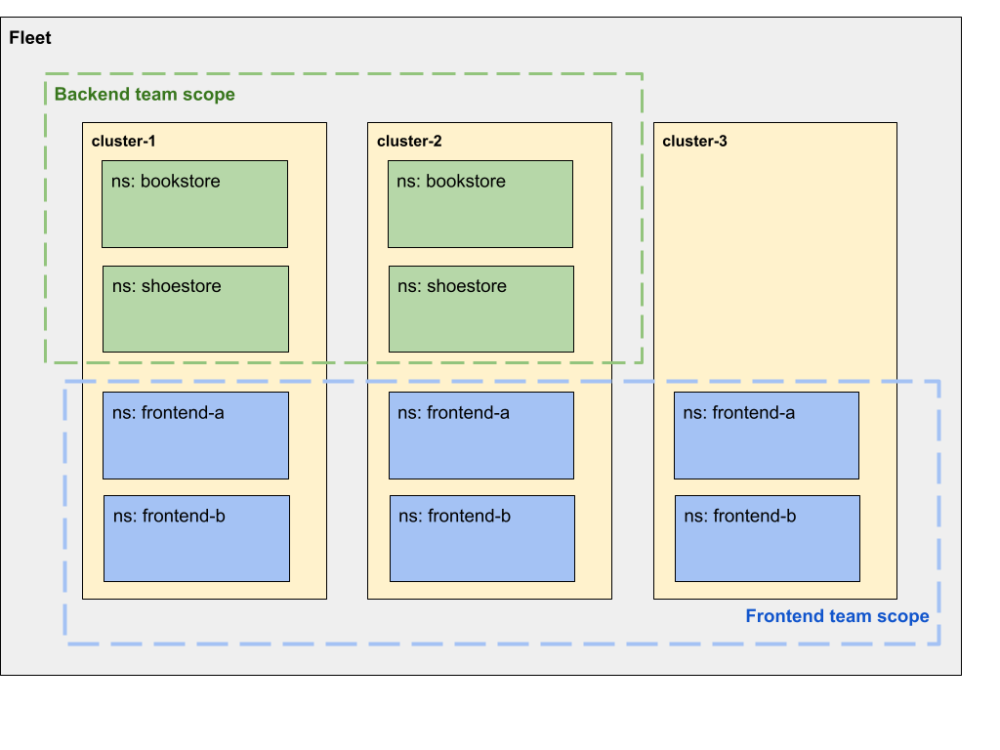

# gke-fleet-examples

This project contains easy-to-follow examples for managing multiple Google Kubernetes Engine (GKE) clusters via [GKE fleets](https://cloud.google.com/kubernetes-engine/docs/fleets-overview).

Contents

1. fleet-and-teams-setup: Contains a Terraform configuration for provisioning a fleet encompassing three clusters and two teams. This serves as a straightforward Terraform implementation of [fleet team management](https://cloud.google.com/anthos/fleet-management/docs/team-management), as illustrated in the diagram. 

2. config-management/configs: A repository demonstrating the use of [Anthos Config Management](https://cloud.google.com/anthos-config-management/docs/tutorials/config-sync-multi-repo) to sync configurations to team namespaces in clusters across the fleet established in the "fleet-and-teams-setup" directory.
